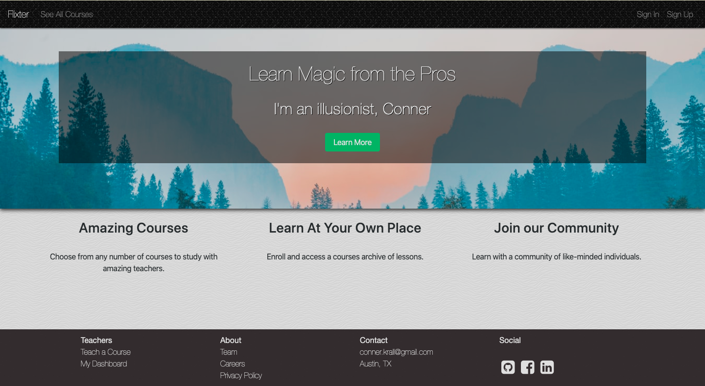
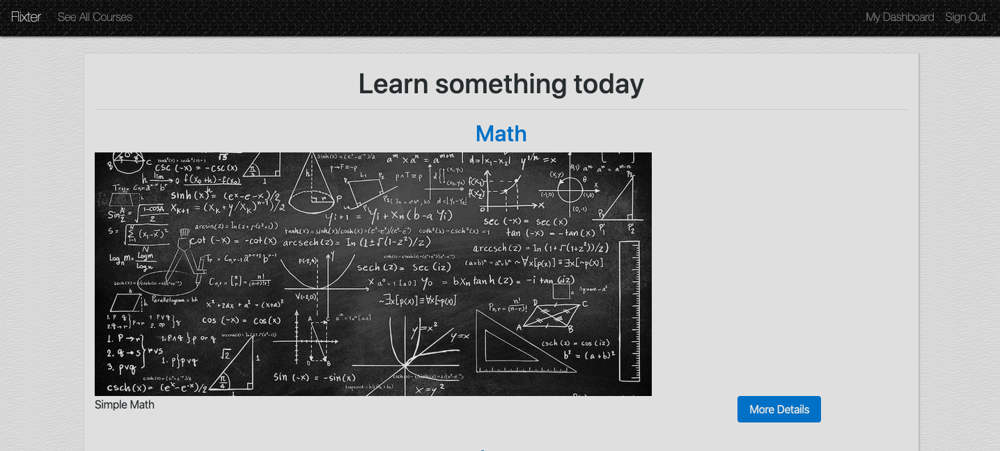
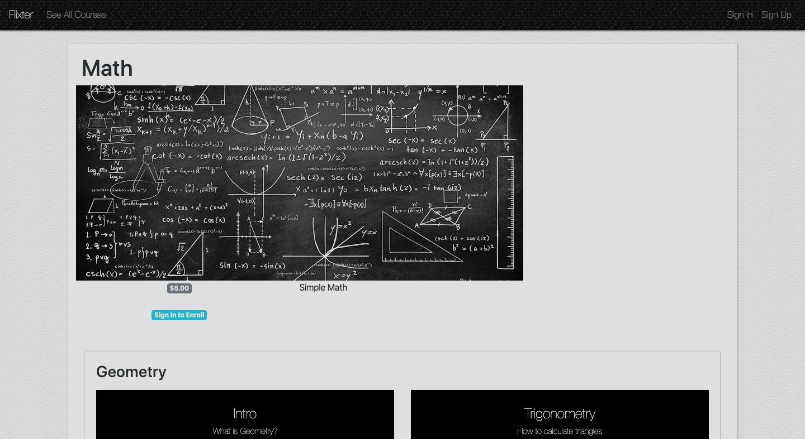
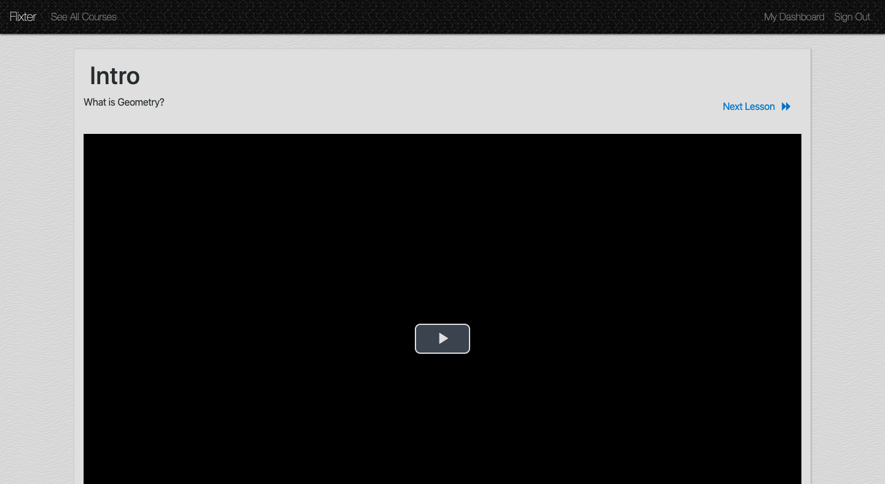
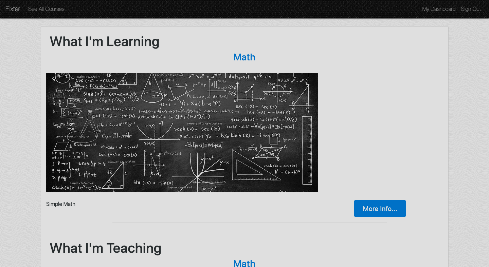

# Flixter

This is a wbsite to upload and watch turtorials. Instructors can upload photos and videos for content. Other users can subscribe to the tutorials as well. Instructors may offer the course for free or charge customers.

The app was built within a Ruby on Rails framework. The information is saved to a PostgreSQL database. Most of the buttons were added using Bootstrap - in conjunction with HTML5 and CSS3. The Devise gem in Rails was used to authenticate users. The Carrierwave gem helps with uploading images/videos. The Stripe gem was used to verify credit card information. JavaScript was used as well: VideoJS was included for embedding videos, and the jQuery sortable function helped with reordering lessons and sections within courses.

## Click [here](https://flixter-conner-krall.herokuapp.com/) to visit the website!

This is the home page:

Pick from several lessons to enroll in:

If you create multiple lessons within a section, you can sort them by dragging:

Note: The above example also applies to sections - you can reorder sections within a course. 

This is how the video page looks:

This is how your dashboard would look after you sign up for a course:

## Tools & Resources

* [Ruby on Rails](https://rubyonrails.org/) 
* [PostgreSQL](https://www.postgresql.org/)
* [Bootstrap](https://getbootstrap.com/)
* [Devise](https://github.com/plataformatec/devise/)
* [Carrierwave](https://github.com/carrierwaveuploader/carrierwave/)
* [Stripe](https://stripe.com/)
* [jQuery: Sortable](https://jqueryui.com/sortable/)
